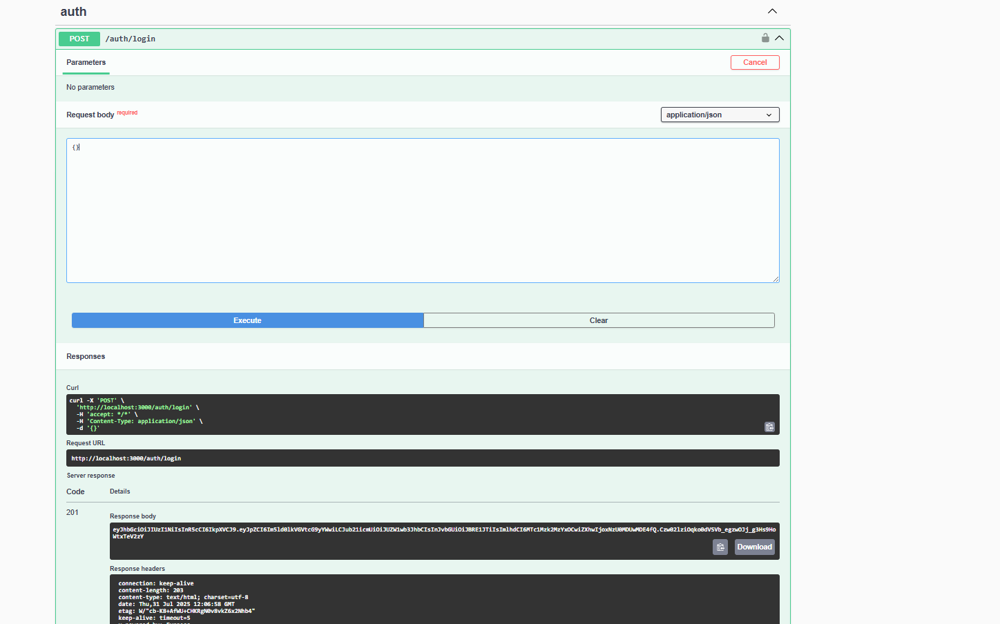
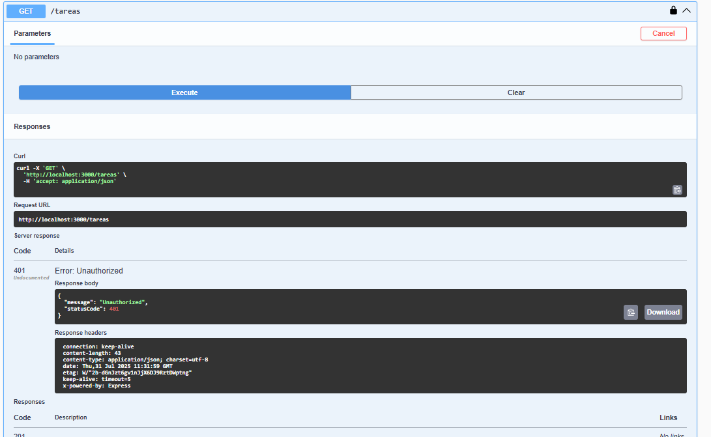
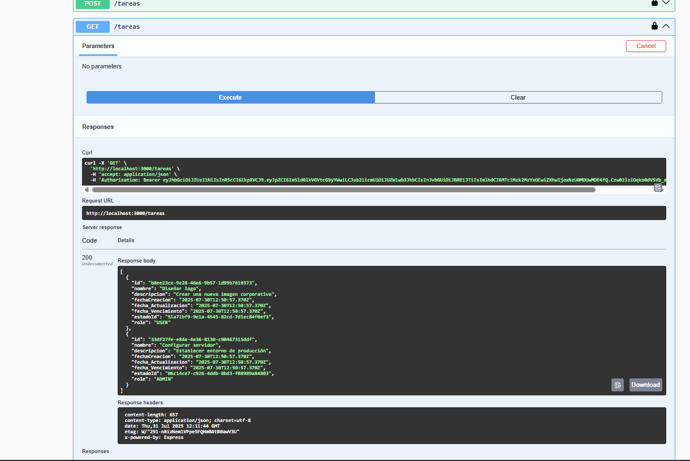
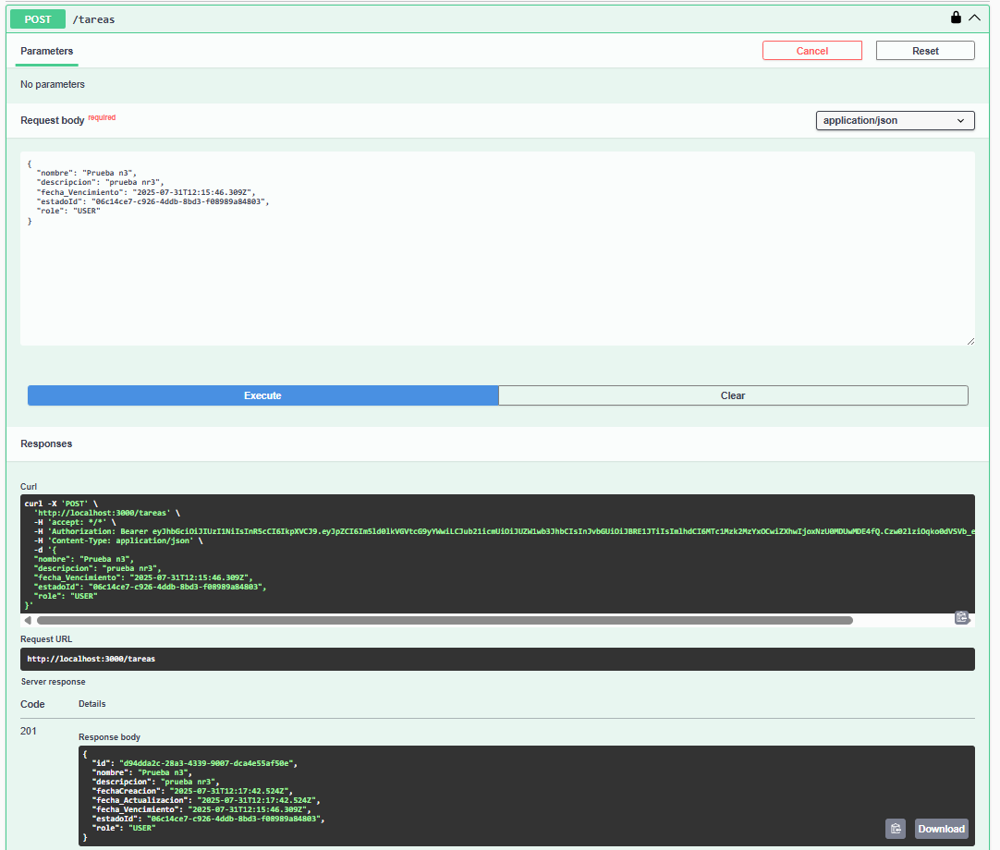
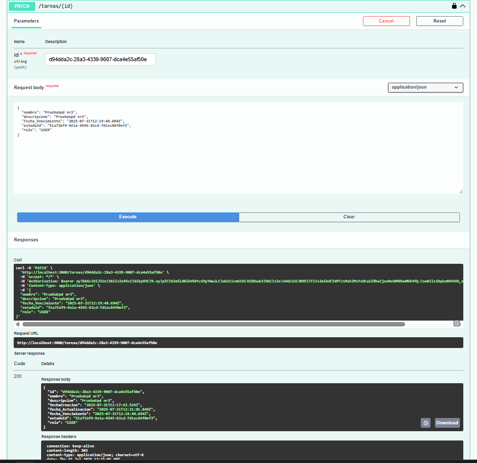
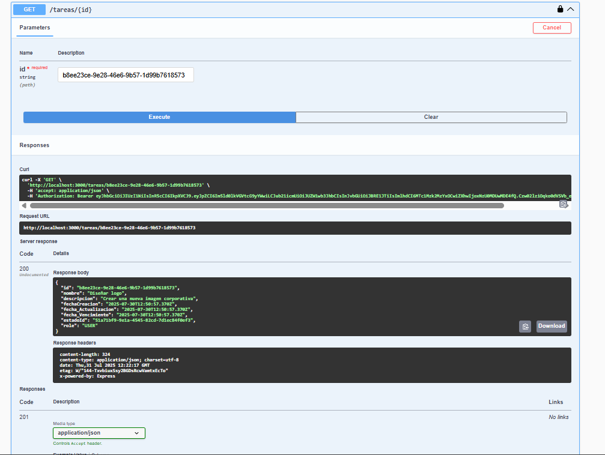

# Prueba Realizada

## Instalación de base datos 

* Instalar postgres

```shell
docker volume create pgdata crear en el docker container 
docker run -p 5432:5432 --name db-test -e POSTGRES_PASSWORD=secret -v pgdata:/var/lib/postgresql/data -d postgres:15.13
#test
docker exec -it db-test psql -U postgres
psql -h localhost -U postgres 
```

## Prerequisitos
### Nestjs
* npm i -g @nestjs/cli
### Creamos Proyecto
* nest new my-prueba-prject

## Levantar la base de datos.
```Shell
docker-compose up
#test
docker ps
```
## Levantar el proyecto 
* npm run start:dev

## Instalar 
* Prima 
* swagger
* jwt 
* passport 
* passport-jwt
* passport-jet
* swagger-ui-express
* node

## Compile and run the project

```bash
# development
$ npm run start

# watch mode
$ npm run start:dev

# production mode
$ npm run start:prod
```

## Run tests

```bash
# unit tests
$ npm run test

# e2e tests
$ npm run test:e2e

# test coverage
$ npm run test:cov
```

## Deployment

```bash
$ npm install -g @nestjs/mau
$ mau deploy
```

## Insertar la tabla de datos estado (Porque tiene relacion con tarea)

* INSERT INTO public."Estado"
(id, nombre, descripcion, "fecha_Creacion", "fecha_Actualizacion")
VALUES('51a71bf9-9e1a-4545-82cd-7d1ec84f0ef3', 'Pendiente', 'Tarea aún no iniciada', '2025-07-30 12:50:57.351', '2025-07-30 12:50:57.351');

* INSERT INTO public."Estado"
(id, nombre, descripcion, "fecha_Creacion", "fecha_Actualizacion")
VALUES('06c14ce7-c926-4ddb-8bd3-f08989a84803', 'En Progreso', 'Tarea en desarrollo', '2025-07-30 12:50:57.367', '2025-07-30 12:50:57.367');

## Pruebas Unitarias 
login


Utilizar el codigo generado para validar todos los enpoint.


Sin usar el codigo login generado.


### Utilizando Codigo Login
Get


Post


Patch


Get con filtro id


Delete
